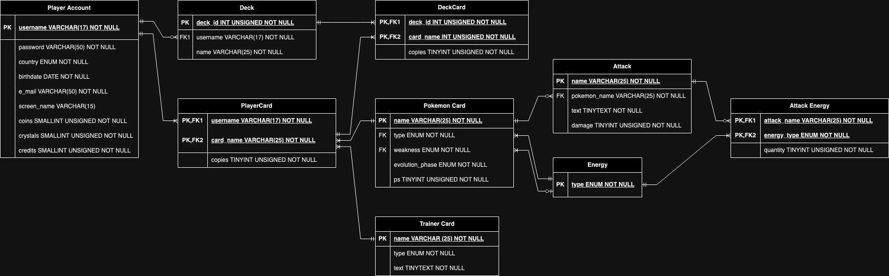

# ER Modeling of Pokemon TCG

## ER Model

This is a possible database (DB) Entity Relation (ER) modelling of the Pokemon 
Trading Card Game (TCG).

## Entities

The following entities were considered:

- [Player Account](#Player-Account)
- [Deck](#Deck)
- [Pokemon Card](#Pokemon-Card)
- [Attack](#Attack)
- [Type](#Type)
- [Trainer Card](#Trainer-Card)

### Player Account

The player account is the main table that the DB should be concerned with. 
It is responsible for giving players access to the game and keeps record of 
all things that concern the player and differentiate them from other players.

It has the following attributes:

- username: used for login and identification.
- password: used for login authentication.
- country: country of residence.
- birthdate: used for age verification.
- e\_mail: used as contact information.
- screen-name: displayed in-game for other players to see.
- coins: type of currency used in-game.
- crystals: type of currency used in-game.
- credits: type of currency used in-game.

### Deck

A deck is the fundamental entity that a player needs to begin a match. It is 
important to keep track of the different decks a player has created as this is 
what the game needs to start a match, and can be customized by the player 
before every match according to their strategy.

It has the following attributes:

- deck\_id: used for identification.
- username: player to which the deck belongs.
- name: displayed name for easier identification.

### Pokemon Card

A single pokemon card which can be added to a deck. At least one is required 
in order to build a deck since one of the game's win-conditions is the 
removal of all active pokemon from the opponent's active spot and bench.

It has the following attributes:

- name: the name of the pokemon. Serves as unique identifier.
- type: the pokemon type, which is important for many game mechanics.
- weakness: increases damage received from certain pokemon types.
- evolution\_phase: determines playability and is important for game mechanics.
- ps: pokemon's resistance to attacks before being knocked out.

### Attack

An attack is part of a pokemon card's composition and determines the game 
mechanics for a given pokemon to attack, but has its own attributes that must 
be considered:

- name: name of the attack. Serves as unique identifier.
- pokemon\_name: name of the pokemon who has that attack.
- text: text description of what the attack does. To be displayed in the card.
- damage: the amount of damage the attack will inflict on oposing pokemon.

### Type

This is a recurring element that is shared accross various entities and could 
at some point be linked to the energy cards, which constitute the second card 
class a deck can be built with, it was decided to assume it as an entity on 
its own, even if its only attribute is:

- name: the name of the type.

### Trainer Card

The complementary card class along with pokemon and energy cards which allows 
for player actions beyond pure combat. These are a crucial part of 
deckbuilding since they can shape a deck's strategy and the player's ability 
to excecute it.

It has the following attributes:

- name: name of the card. Serves as unique identifier.
- category: determines which game mechanics it affects.
- text: describe the effect the card has. To be displayed in the card.
